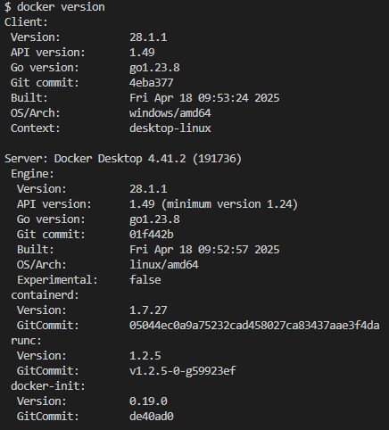
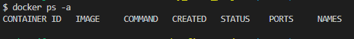
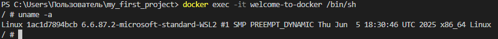
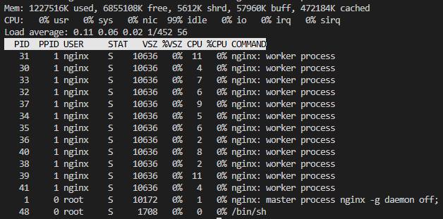
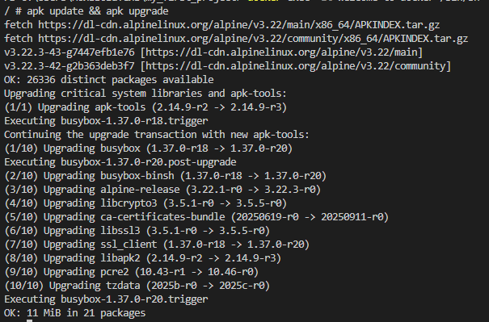
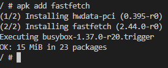
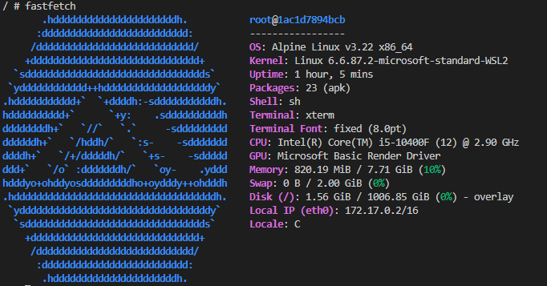
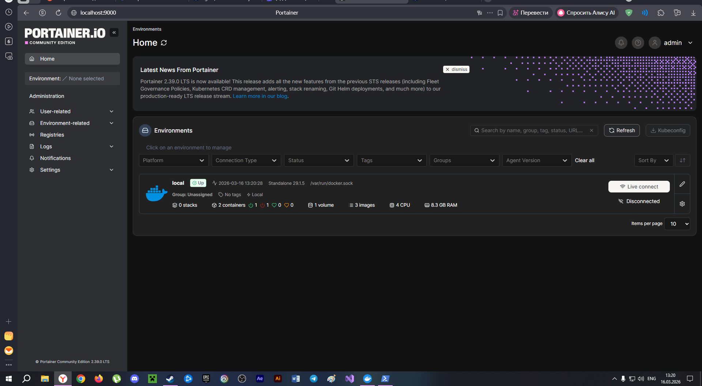

# Docker: Welcome to Docker

## Описание проекта
В этом проекте я познакомился с основами Docker: скачал образ, запустил контейнер, выполнил базовые команды внутри контейнера и установил дополнительное ПО.

## Подготовка
Перед началом работы проверил, что порт 8088 не занят:

```shell
netstat -tuln | grep :8088
```
(для Windows используется `netstat -aon | findstr :8088`)

Порт свободен — можно продолжать.

Получить версию установленного у вас Docker
```shell
docker version
```



> Готовые образы берутся из сторонних источников: **Docker Hub** или другие

[Ссылка на Docker Hub](https://hub.docker.com/)

### Подготовка Docker (чтобы начать работать с "чистого листа")

1. Остановить все запущенные контейнеры
1. Удалить все остановленные контейнеры
1. Удалить все неиспользуемые образы

- Следует убедиться, нет ли у вас уже установленных и запущенных контейнеров:
```shell
docker ps -a
```
- Если есть, то лучше их остановить:
```shell
docker stop $(docker ps -q)
```
- Если остановленные контейнеры не нужно, то удалить их:
```shell
docker container prune
```
или
```shell
docker container prune $(docker ps -q)
```
- Ещё раз убедиться, что нет лишних контейнеров:
```shell
docker ps -a
```



- Опционально можно удалить ненужные образы. Показать текущие образы:
```shell
docker images
```
Удалить все ненужные образы
```shell
docker image prune -a
```
или
```shell
docker rmi $(docker images -q)
```

> Удалять нужно только учебные контейнеры и образы, т.к. есть риск потерять важные данные, которые могут содержаться в контейнерах!

### Получение готового образа Welcome-To-Docker
## Шаг 1: Запуск контейнера
Выполнил команду для скачивания образа и запуска контейнера:

```shell
docker run -d -p 8088:80 --name welcome-to-docker docker/welcome-to-docker
```

## Шаг 2: Проверка работы в браузере
Открыл в браузере http://localhost:8088

**Результат:**


## Шаг 3: Подключение к контейнеру
Зайдя внутрь контейнера с помощь
```

**Результат:**


## Шаг 4: Изучение системы внутри контейнера
Выполнил базовые команды для просмотра информации о системе:

```shell
# Информация о ядре ОС
uname -a

# Диспетчер ресурсов (запускается интерактивно)
top
```

**Результат uname -a:**


**Результат top:**


## Шаг 5: Обновление пакетов
Обновил список пакетов и сами пакеты (в данном образе используется Alpine Linux с пакетным менеджером `apk`):

```shell
apk update && apk upgrade
```

**Результат:**


## Шаг 6: Установка дополнительного ПО
Установил программу `fastfetch` (современная альтернатива `neofetch` для вывода информации о системе):

```shell
apk add fastfetch
```

**Результат установки:**


## Шаг 7: Запуск fastfetch
Запустил установленную программу:

```shell
fastfetch
```

**Результат:**



**Portainer**


**Для windows**
```shell
docker run -d ^
  --name portainer ^
  -p 9000:9000 ^
  -p 9443:9443 ^
  -v /var/run/docker.sock:/var/run/docker.sock ^
  -v portainer_data:/data ^
  --restart unless-stopped ^
  portainer/portainer-ce:latest
```
**Для Linux WSL Mac**
```shell
docker run -d \
  --name portainer \
  -p 9000:9000 \
  -p 9443:9443 \
  -v /var/run/docker.sock:/var/run/docker.sock \
  -v portainer_data:/data \
  --restart unless-stopped \
  portainer/portainer-ce:latest
```


